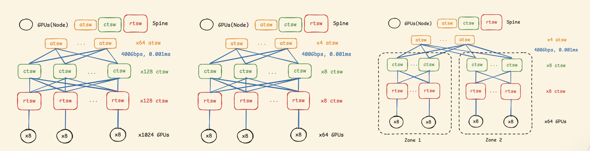
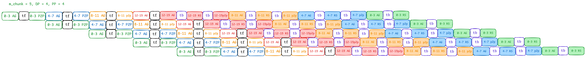

# CollScope NS3

This part is adapted from [Vedrfolnir](https://github.com/Networked-System-and-Security-Group/Vedrfolnir), Special Thanks to their open source!

## Topology

We provided 3 topologies show as follows, which adapted from [RDMA over Ethernet for Distributed Training at Meta Scale](https://dl.acm.org/doi/abs/10.1145/3651890.3672233).



## Behaviours

The basic pipelines we want to simulate is like [PipeDream: Fast and Efficient Pipeline Parallel DNN Training](https://arxiv.org/abs/1806.03377), which is also adapted in [DeepSpeed](https://www.deepspeed.ai/tutorials/pipeline/).



## Quick Start

### Build

```bash
cd CollScope-NS3
./waf configure -d configure
```

Please note if gcc version > 5, compilation will fail due to some ns3 code style. If this what you encounter, please use:

```bash
CC='gcc-5' CXX='g++-5' ./waf configure
```

### Experiment setup

Please see `CollScope-NS3/hybrid_dppp/config.txt` for example.

### Run

```bash
NS_LOG="HybridCC=info" ./waf --run 'scratch/hybrid_dppp hybrid_dppp/config.txt' 2>&1

# For finer log, use:
NS_LOG="HybridCC=all" ./waf --run 'scratch/hybrid_dppp hybrid_dppp/config.txt' 2>&1
```
