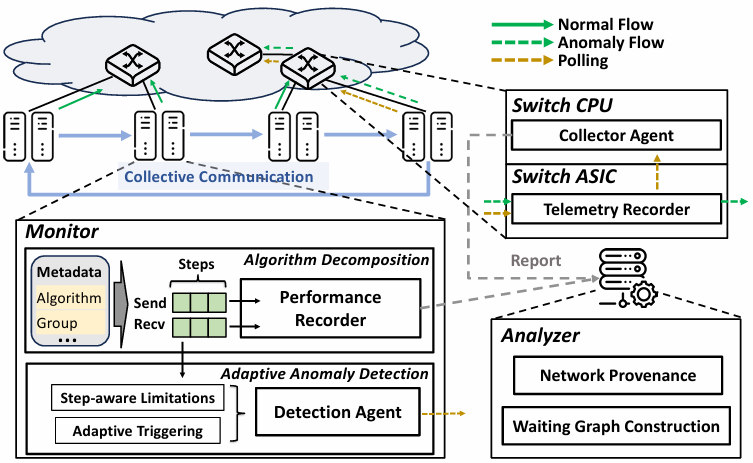

# Vedrfolnir

This branch contains the source code of the prototype for our paper: `Vedrfolnir: RDMA Network Performance Anomalies Diagnosis in Collective Communications` in INFOCOM 2026.



The code is based on [NS-3 simulator for Hawkeye](https://github.com/hawkeye-anonymous/Hawkeye), with NS-3 version 3.17. 

## Quick Start

### Build

```
cd Vedrfolnir
./waf configure
```

Please note if gcc version > 5, compilation will fail due to some ns3 code style. If this what you encounter, please use:

```
CC='gcc-5' CXX='g++-5' ./waf configure
```

### Experiment setup

Please see `Vedrfolnir/mix_allreduce/config.txt` for example.

### Run

```
./waf --run 'scratch/mix_allreduce mix_allreduce/config.txt'
```

This will run a diagnostic example of ring allreduce. You can read `mix_allreduce.cc` in detail to understand the main logic of the simulation.

During the run, data output from the host side is logged in `mix_allreduce/out/fct.txt` and telemetry data output from the switch is logged in `mix_allreduce/data`. After the run of the simulation, in `mix_allreduce/data` directory, execute `python graph.py` to build the waiting graph and network provenance graphs. The diagnostic results will be also output in `mix_allreduce/data` directory.

## Evaluation

We provide test scripts for the paper evaluation section in the following directorys:

- `Vedrfolnir/mix_allreduce/Flow_contention_tests`
- `Vedrfolnir/mix_allreduce/Incast_tests`
- `Vedrfolnir/mix_allreduce/PFC_backpress_tests`
- `Vedrfolnir/mix_allreduce/PFC_injection_tests`

These correspond to the four test scenarios: flow contention, incast, PFC backpressure, and PFC storm, respectively. You can modify the configurations in `create_config.py` and run `run_test.sh` to reproduce the tests in the paper. Before testing, please replace `/Vedrfolnir/scratch/mix_allreduce.cc` with the `mix_allreduce.cc` file from the test directory, and then compile it.

We provide two examples: `Vedrfolnir/mix_allreduce/test_case_1` for flow contention and `Vedrfolnir/mix_allreduce/test_case_2` for PFC storm. You can use `test_case_1` to reproduce the Case Study presented in the paper.

## Citation

The branch corresponds to the open source code of paper:

> Yuxuan Chen, Menghao Zhang, Xiheng Li, Fangzheng Jiao, Xiao Li, Jiaxun Huang, Shicheng Wang, Chunming Hu. Vedrfolnir: RDMA Network Performance Anomalies Diagnosis in Collective Communications. In the 45th IEEE International Conference on Computer Communications (INFOCOM), Tokyo, Japan, May 18-21, 2026.

If you find it useful in your research, please consider citing:

- BibTeX:

```
@inproceedings{Vedrfolnir2026,
  author    = {Yuxuan Chen and Menghao Zhang and Xiheng Li and Fangzheng Jiao and Xiao Li and Jiaxun Huang and Shicheng Wang and Chunming Hu},
  title     = {Vedrfolnir: RDMA Network Performance Anomalies Diagnosis in Collective Communications},
  booktitle = {the 45th IEEE International Conference on Computer Communications (INFOCOM)},
  year      = {2026}
}
```