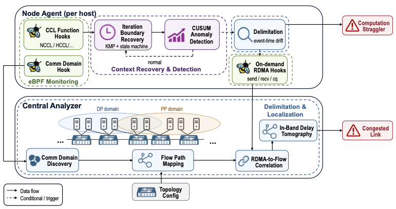

# CollScope

To facilitate further research, we have open-sourced the CollScope prototype for our paper: **`CollScope: Dynamic Training Semantic Alignment for Non-Intrusive Straggler Diagnosis`**, including our eBPF-based tracking suite, the core algorithms for end-to-end anomaly detection, delimitation, localization, and the simulation code for hybrid-dppp implemented with the Discrete Event Network Simulator.



## Structure

```txt
.
|-- CollScope-NS3               # The NS3 simulator for network side hybrid collective communication.
|-- README.md                       
|-- dockerfile                  # Dockerfile for Network Simulation.
|-- eBPF                        # ebpf detectors.
|-- hook_output                 # The hook_output for network simulations.
`-- straggler-algorithms        # The Core Straggler Algorithms.
```

## Citation

[TBD]...
